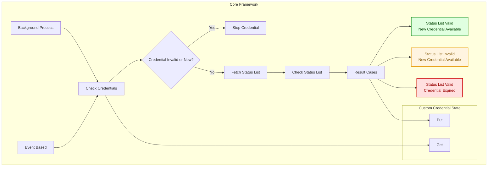
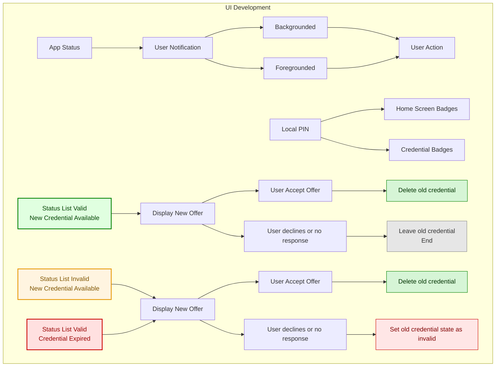
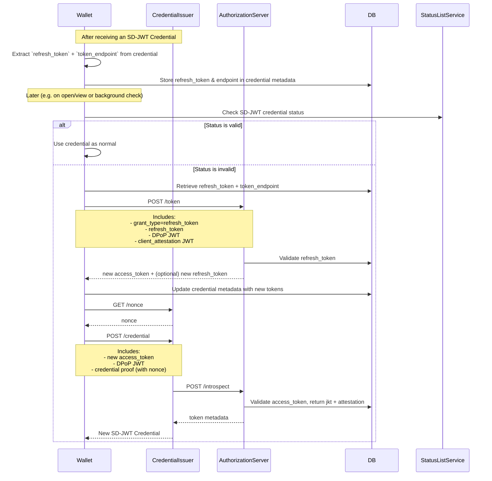
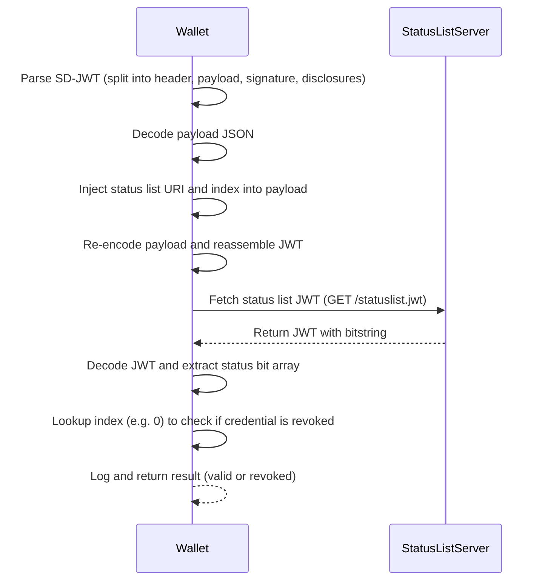

# OpenID Credential Refresh Lifecycle

> Information and architecture diagram for checking/refreshing OpenID credentials

## 📌 Overview

This diagram illustrates the wallet-side process for verifying the validity of an SD-JWT credential using a status list. The credential’s status is checked either periodically via background processing or in response to user actions, such as viewing, opening, or presenting the credential. If the credential is found to be invalid, the wallet attempts to use a previously stored refresh token to obtain a new access token, which is then used to request a fresh credential from the issuer. This ensures credentials remain up-to-date and trusted without requiring manual intervention.

## 🔄 SD-JWT Credential Status Flow – Wallet-Side

This system supports **robust, standards-based credential lifecycle management** within a digital wallet environment. It ensures Verifiable Credentials (VCs) based on **SD-JWT** remain valid, trustworthy, and up-to-date, using automated background and user-driven processes. Key features include:

- 🔐 **Stored Refresh Token Usage** – Enables silent access token renewal without re-authentication
- 🔎 **Status List Verification** – Periodic or on-demand checks against SD-JWT status lists to detect revoked or expired credentials ([draft-ietf-oauth-status-list](https://datatracker.ietf.org/doc/draft-ietf-oauth-status-list/))
- 🔁 **Refresh-on-Invalidation** – Automatic reissuance flow triggered when a credential is found to be invalid
- 📱 **Passive & Active Triggers** – Background checks or user-driven interactions (e.g., viewing, opening, presenting) initiate verification
- 🧠 **Credential State Caching** – Custom local state used to track validity, offer display, and user decision history
- 🎛️ **User Notification & UI Integration** – Dynamic in-app offer display, badge updates, and graceful credential replacement workflows

### 🔧 Wallet-Side Components

- **Background Process Manager**  
  Runs silent status list verification tasks on a schedule or system triggers.

- **User Event Hooks**  
  Checks are initiated when a user opens, views, or presents a credential.

- **Status List Resolver**  
  Efficiently parses and validates status bits for SD-JWT credentials.

- **Refresh Flow Handler**  
  Uses stored refresh tokens to retrieve new access tokens and request updated credentials without user interruption.

- **Custom Credential State Store**  
  Caches local metadata like credential status, active offers, and user decisions for UX continuity.

This design prioritizes **user transparency, reliability, and automation**, creating a seamless credential lifecycle experience within self-sovereign and wallet-driven ecosystems.





## Refresh Token Lifecycle



## 🔄 SD-JWT Credential Refresh Flow (Using Refresh Token)

After the wallet successfully obtains an SD-JWT credential from the credential issuer, it extracts the `refresh_token` and the `token_endpoint` (typically embedded within the credential or its metadata). These values are securely stored in the credential’s metadata for future use.

At a later point — triggered either by background processes or user interaction (e.g., viewing or presenting the credential) — the wallet checks the status of the credential using the associated **Status List**. If the credential is found to be **revoked or invalid**, the wallet initiates a refresh sequence:

### Steps:

1. **Retrieve Stored Tokens**  
   The wallet retrieves the `refresh_token` and `token_endpoint` from the credential’s metadata.

2. **Request New Access Token**  
   The wallet sends a `POST /token` request to the issuer's authorization server with:

   - `grant_type=refresh_token`
   - The `refresh_token`
   - DPoP proof
   - Client attestation (e.g., Firebase / App Attest)

3. **Store New Tokens**  
   If the request is successful, the wallet receives a new `access_token` (and possibly a new `refresh_token`) and stores them in the credential metadata.

4. **Request New Credential**  
   Using the new `access_token`, the wallet:

   - Retrieves a fresh `nonce` from the issuer via `GET /nonce`
   - Sends a `POST /credential` request with:
     - The `access_token`
     - DPoP proof
     - Credential proof (bound to the nonce)

5. **Receive New Credential**  
   The credential issuer performs token introspection and verification, then issues a new SD-JWT credential to the wallet.

This flow ensures the wallet can self-recover from revoked credentials and maintain up-to-date verifiable credentials without requiring manual user intervention.

## 🔐 Storing Refresh Tokens in the Wallet

When handling SD-JWT credentials with refresh capabilities, the wallet must securely store the **refresh token** (and optionally the access token) received during issuance. This token is later required for:

- Credential status checks
- Requesting a new credential after revocation

There are two main options for storing this token in the wallet:

---

### ✅ Option 1: Store Token in Credential Metadata (as JSON)

Using helper methods like the following:

```ts
/**
 * Gets the refresh credential metadata from the given credential record.
 */
export function getRefreshCredentialMetadata(
  credentialRecord: W3cCredentialRecord | SdJwtVcRecord | MdocRecord
): RefreshCredentialMetadata | null {
  return credentialRecord.metadata.get(refreshCredentialMetadataKey)
}

/**
 * Sets the refresh credential metadata on the given credential record
 */
export function setRefreshCredentialMetadata(
  credentialRecord: W3cCredentialRecord | SdJwtVcRecord | MdocRecord,
  metadata: RefreshCredentialMetadata
) {
  credentialRecord.metadata.set(refreshCredentialMetadataKey, metadata)
}
```

### ✅ Advantages of Option 1: Store Token in Credential Metadata

- ✅ Easy to implement using existing wallet data structures
- ✅ Supports background processing without requiring user interaction
- ✅ Cross-platform compatibility with no native dependencies
- ✅ Flexible and accessible from credential context
- 🟡 Security depends on wallet’s internal data protection mechanisms

---

### 🔐 Option 2: Store Token in Secure Enclave (Keychain / Keystore)

Use platform-secure storage backed by hardware security modules:

- **iOS**: Secure Enclave via Keychain
- **Android**: Keystore with BiometricPrompt

#### ✅ Advantages:

- ✅ Strongest protection using hardware-backed encryption
- ✅ Access gated via biometrics or passcode
- ✅ Token never exposed in app memory
- ✅ Ideal for high-security scenarios

#### ❌ Limitations:

- ❌ Token cannot be accessed silently — requires user interaction
- ❌ Not suitable for background refresh flows
- ❌ Requires native modules or bridging
- ❌ Complex implementation and platform-specific maintenance

---

## 🔄 SD-JWT Credential Status Verification

### ✅ Overview

This flow describes how the wallet verifies the status of a received SD-JWT credential using the status list URI and index. If the credential is marked as revoked, the wallet can optionally trigger a refresh or reissuance flow (not shown here).

The process involves:

- Decoding the SD-JWT
- Extracting and modifying the payload to include a status list reference (URI + index)
- Reconstructing the JWT
- Fetching the remote status list JWT
- Extracting the status list bitmap
- Verifying the revocation status of the specific credential index

### Sequence Diagram: SD-JWT Status List Check



## 🔑 Key Functions for SD-JWT Status List Verification

These are the core functions used in the wallet to verify whether an SD-JWT credential has been revoked using the associated status list:

```ts
// Extract the status list URI and index from the SD-JWT
const reference = getStatusListFromJWT(newCompactJwt)

// Fetch the status list JWT from the issuer
const response = await fetch(reference.uri)

// Decode the status list and obtain the bit array
const statusList = getListFromStatusListJWT(jwt)
```

### 📋 Credential Status Handling Overview

When performing a **Status List check** on an SD-JWT or other verifiable credential, the wallet determines the next action based on the credential’s revocation or suspension state and the availability of a replacement credential. This ensures a seamless user experience while maintaining trust and validity of stored credentials.

### Possible Outcomes

1. **✅ Credential status is valid**

   - Keep the current credential without changes.
   - No further action required until the next scheduled status check.

2. **♻️ Credential status is invalid and a new credential is available**

   - Initiate a credential refresh flow using the stored refresh token and issuer endpoint.
   - Replace the outdated credential with the new one.

3. **⚠️ Credential status is invalid and no new credential is available**
   - Follow the wallet’s UX guidelines, e.g.,
     - Display a badge or warning icon.
     - Restrict credential usage in proof presentations.
     - Notify the user about the issue and possible next steps.

### 📄 Sample Status List JSON

Below is an example of a decoded **Status List** payload, showing how credential revocation states are represented.

```json
{
  "status_list": {
    "id": "https://issuer.example.com/statuslist/2025-08.jwt",
    "type": "StatusList2021",
    "encodedList": "H4sIAAAAAAAA_1MwzUjOyS9KzEtXyU9VslIqzEvxUVDwTSwuLU4syczPBgAHeY5FjAAAAA",
    "length": 16,
    "index": 42
  },
  "issuer": "https://issuer.example.com",
  "issued": "2025-08-08T10:00:00Z"
}

**Key Fields:**

- **`id`** – The URI where the status list can be retrieved.
- **`encodedList`** – Compressed bitstring representing the status of each credential in the list.
- **`index`** – Position of the credential in the bitstring.
- **`issuer`** – The entity maintaining the status list.
- **`issued`** – Timestamp when the list was last updated.
```
