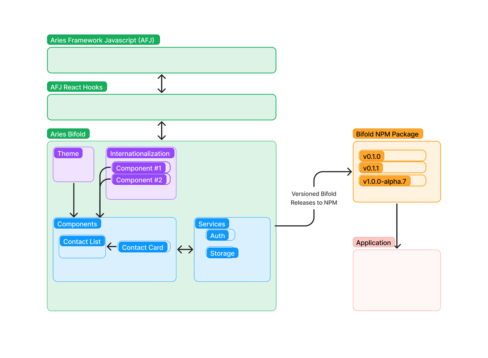

# Bifold Component Architecture Adjustment

The Aries Bifold project is seeking a strategy adjustment that will make it more useful, and easier to contribute back to the common library of components that combine to create a full mobile app.

## Purpose
The goal of this effort is to generalize Bifold to allow further code reuse and make the process of contributing back to the project easier. This will also reduce the amount of code that must be maintained within each project leveraging Bifold code.

Within the project, we will build a library of common components that, in combination, provide the necessary components of an Aries mobile app.

We will ship the components via NPM. Projects including the library will draw upon the components that match their needs.

Components exist at multiple levels, including one sample application that demonstrates the lower level components combined into a top level app.

### Types of Components

Components of different types are useful in the Bifold component collection. From the simplest UI component to app navigation, there are a variety of components that fit this design.

- UI Elements
- Screens
- Services

Services are non-visible components that provide necessary portions of agent behavior. Not all services will be required in an agent.

As we gain experience, this list is likely to become more refined.

## Conceptual Diagram

## Component Guidelines

* Components can be smaller items, like a contact card, and larger items such as a contact list. Components can use other components.
* Sub-components should be easily overridable / extended to allow for larger components to be used with a different subcomponent.
* Component styles should be easily overridable / extended to allow the application of themes for the purpose of a blended visual user experience.
* Components should not manage navigation, as not all components will be involved in the same navigation flows.
* Components should provide hooks into component lifecycle to allow the app to take action, including navigation.
* Component’s text need to be easily extended and need to be easily translatable to assist in internationalization.

## Component Creation

A good common component is one that can be used by more than one Bifold based app. It should allow for the customization nessary to fit the needs of various applications.

If the customization of a component results in a significant change from the original component, it may make sense to create a new component. The component architecture accepts competing components when the needs of different Bifold based projects diverge.

The choice between customizing an existing component and adding a new competing one will be common. Experience will provide insight into this choice. Guidance should be recorded as a guide to others considering their options.

### Process for bringing Bifold forks back to the codebase
Existing apps will need to follow a process to draw closer to the core Bifold codebase. While there will be some natural variance, the same basic strategy will apply.

1. Import NPM Library
	- Include LIbrary as Dependancy
	- Replace repo code with existing library components
2. Contribute New Components
    - Identify components for contribution
    - Add customization if needed
    - Contribute to Bifold component collection
    - Update library to release containing newly contributed components
    - Replace local components with library components
    - Remove local components from codebase
3. Rinse and Repeat
    - Continue process with new development
    - Adopt new and updated components contributed by others
    - Contribute new developments back to component library.

### Process for creating new bifold forks
We will need to guide new Bifold based projects into the patterns that this component method will provide.

Providing a sample application, composed of library components. Readme files can guide the process of creating a new project using the component patterns supported by the common component library. Command line scripts may also be helpful here.