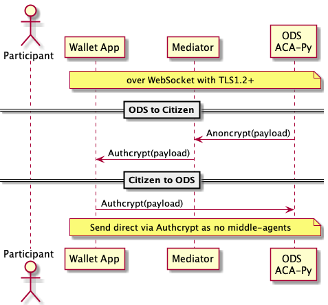

# 0.0 Document Intent

This document is intended to be consumed by non-developers so they can build an understanding of the underpinnings of the key cryptography usage in an Aries-based solution. In particular, the Aries Bifold wallet.

# 1.0 Key ARIES RFCs

The following RFCs relate to the message (envelope) encryption and communication and wallet..

## [Aries RFC 0019:](https://github.com/hyperledger/aries-rfcs/blob/main/features/0019-encryption-envelope/README.md) Encryption Envelope

[Aries RFC 0019](https://github.com/hyperledger/aries-rfcs/blob/main/features/0019-encryption-envelope/README.md)

- note that "Routing Endpoint" in this document is equivalent to Mediator.
- key difference in **Anoncrypt** is that the sender is anonymous, while with **Authcrypt** the sender is known (should only be at recipient end).
- Messages are nested messages are encrypted via ChaCha20 with a Poly1305 one-time authenticator (consider as nonce??). See [RFC 7539](https://datatracker.ietf.org/doc/html/rfc7539) for further detail on this encryption approach.
  - There are some good examples of how libsodium is used generically [here](https://libsodium.gitbook.io/doc/public-key_cryptography/authenticated_encryption).

Figure 1: Flow of encrypted and layered "envelopes" of relayed messages in DIDComm flow.

## [Aries RFC 0025](https://github.com/hyperledger/aries-rfcs/blob/main/features/0025-didcomm-transports/README.md) DIDComm Transports

[Aries RFC 0025](https://github.com/hyperledger/aries-rfcs/blob/main/features/0025-didcomm-transports/README.md)

Discusses the use of various transports. Web Sockets is used in the ACA-Py Mediator with the wallet.

- RECOMMEND that ACA-Py (full server and mediator) be configured to use Web Sockets a configure it to use TLS 1.2+. TLS 1.2+ creates "perfect forward secrecy" and uses FIPS-compatible encryption.

## [Aries RFC 0050 - Wallet Design](https://github.com/hyperledger/aries-rfcs/blob/main/concepts/0050-wallets/README.md)

[Aries RFC 0050](https://github.com/hyperledger/aries-rfcs/blob/main/concepts/0050-wallets/README.md)

Presents the design concepts behind the Aries Wallet that is embedded in the solution. There is a good (long - 1.5 hour) [youtube video](https://youtu.be/Km4IoUdb3Lc) that presents things well for multiple audiences (analysts, developers, architects, etc.). NOTE that this video refers to an Indy HIPE - it has been superceded by Aries RFC 0050.
