# 🔄 Introduction

Modern digital wallets must ensure that verifiable credentials remain **valid and up to date** without requiring user intervention.  
In OpenID4VC ecosystems — especially those using **SD-JWT VCs** with **status lists** — credentials can expire or be revoked by the issuer.  
To maintain a consistent and trustworthy wallet experience, the system must automatically detect invalid credentials and securely refresh them.

This module implements a **self-contained credential refresh lifecycle** inside the wallet core:

- ✅ **Detects invalid or revoked credentials** via SD-JWT status list checks.
- 🔐 **Refreshes credentials securely** using stored refresh tokens to obtain new access tokens.
- 🪄 **Re-issues new credentials** from the issuer without user action.
- 🔔 **Notifies the user** through a lightweight registry and non-intrusive app notifications.
- 🧠 **Separates responsibilities**: the UI stays simple, while background logic handles protocol-level complexity.

### Core design principles

| Principle           | Description                                                                                                                 |
| ------------------- | --------------------------------------------------------------------------------------------------------------------------- |
| **Isolation**       | Verification, re-issuance, and caching are handled in a background service (`RefreshOrchestrator`) independent of UI logic. |
| **Resilience**      | `AgentBridge` abstracts the live Credo `Agent`, automatically re-binding after wallet lock/unlock.                          |
| **Simplicity**      | The app layer interacts only with the `credentialRegistry`, which exposes lightweight “replacement available” entries.      |
| **Transparency**    | Each refresh step is logged via `BifoldLogger` for clear traceability during audits or debugging.                           |
| **User-centric UX** | Users see a simple “Replacement available” notification and can review the new credential with one tap.                     |

**Outcome:**  
A stable, low-maintenance refresh architecture that quietly preserves credential validity and integrity while keeping the wallet experience frictionless.

# 🧩 High-Level Overview

The credential refresh system is composed of several cooperating layers within the wallet core.  
Each layer has a distinct purpose, keeping the logic modular, testable, and resilient to agent restarts or UI reloads.

---

## 🏗️ Main Components

| Component               | Role                                                                                                                                                                  |
| ----------------------- | --------------------------------------------------------------------------------------------------------------------------------------------------------------------- |
| **AgentBridge**         | Holds the current live `Agent` instance from Credo-TS and emits lifecycle events (`onReady`, `onChange`, `onClosed`) when the agent is created, cleared, or replaced. |
| **RefreshOrchestrator** | A headless service responsible for verifying credentials, refreshing access tokens, and reissuing new credentials on a timer or manual trigger.                       |
| **credentialRegistry**  | A lightweight in-memory registry (Zustand store) that tracks credential states — which are active, which are expired, and which have replacements available.          |
| **UI Layer**            | Reads from `credentialRegistry` to show lightweight notifications and navigates to the offer screen when the user accepts a new replacement.                          |

---

## 🔁 Lifecycle Summary

1. **Agent Initialization**  
   When the wallet unlocks, the `AgentBridge` fires an `onReady` event with a live Credo `Agent`.  
   The `RefreshOrchestrator` binds automatically and prepares to start its refresh loop.

2. **Periodic or Manual Refresh**  
   The orchestrator runs on a set interval (e.g., every 15 minutes) or via manual trigger (e.g., debug menu).

3. **Verification Phase**  
   Each stored credential is verified for validity using the `verifyCredentialStatus` utility.

   - If **valid**, it’s skipped.
   - If **invalid**, it moves to the refresh flow.

4. **Refresh Phase**  
   The orchestrator obtains a new access token using `refreshAccessToken()` and requests a new credential with `reissueCredentialWithAccessToken()`.

5. **Registry Update**  
   A lightweight version of the new credential (`toLite`) is stored in `credentialRegistry`, mapping the old ID to its replacement.

6. **Notification**  
   The app reads the registry and displays a “Replacement Available” notification via the notification hook.

7. **User Action**  
   The user taps the notification → navigates to the offer screen → reviews and accepts the new credential.  
   Once accepted, the registry clears the old entry and marks the replacement as active.

---

## ⚙️ Architectural Benefits

- **Agent-agnostic:** the orchestrator reattaches automatically after lock/unlock without app restarts.
- **UI-decoupled:** the UI never interacts with tokens or network calls.
- **Observable:** all internal transitions are logged through the shared `BifoldLogger`.
- **Composable:** utilities (`verifyCredentialStatus`, `refreshAccessToken`, etc.) can be reused for testing or standalone operations.
- **Failsafe:** any failed credential refreshes are skipped until the next cycle — never blocking the rest of the batch.

---

Next: [🧱 Component Relationships Diagram](#🧱-component-relationships-diagram)

# 🧱 Component Relationships Diagram

Below is a high-level architecture diagram showing how each part interacts within the wallet core.

```mermaid
flowchart TD

  %% ====== WALLET CORE ======
  subgraph Core["💠 Wallet Core"]
    direction TB

    AgentBridge["🔌 AgentBridge<br/>(Broadcasts active Agent)"]
    Orchestrator["♻️ RefreshOrchestrator<br/>(Checks & refreshes credentials)"]
    Registry["🧮 CredentialRegistry<br/>(Zustand store for lite credentials)"]
    Verify["✅ verifyCredentialStatus<br/>(Checks revocation lists)"]
    RefreshToken["🔐 refreshAccessToken<br/>(Obtains new access token)"]
    Reissue["📄 reissueCredential<br/>(Requests new credential)"]
  end

  %% ====== UI LAYER ======
  subgraph UI["🖥️ UI Layer (React Native)"]
    direction TB
    Notifications["🔔 useReplacementNotifications<br/>(Builds notifications)"]
    HomeTab["🏠 Home Tab<br/>(Displays badge & list)"]
    OfferScreen["🎁 Offer Screen<br/>(Accepts new credential)"]
  end

  %% ====== Data Flow ======
  AgentBridge -->|"Agent ready"| Orchestrator
  Orchestrator -->|"verify →"| Verify
  Orchestrator -->|"refresh →"| RefreshToken
  Orchestrator -->|"reissue →"| Reissue
  Orchestrator -->|"update →"| Registry

  Registry -->|"state →"| Notifications
  Notifications -->|"notify →"| HomeTab
  HomeTab -->|"open →"| OfferScreen
  OfferScreen -->|"accept → update"| Registry

```



### 🧩 Flow Summary

1. **AgentBridge** — Emits agent readiness whenever the wallet unlocks, ensuring that all dependent components (like the orchestrator) always use the most recent active agent instance.

2. **RefreshOrchestrator** — Runs periodically (or manually) to verify credential validity using status lists, obtain new access tokens when needed, and reissue updated credentials. Updates the **CredentialRegistry** after each refresh cycle.

3. **CredentialRegistry** — Serves as the single source of truth for all credential states:

   - Active credentials currently valid in the wallet
   - Refreshing credentials being revalidated
   - Expired credentials that have a newer replacement available

4. **🔔 `useReplacementNotifications`** — The key UI hook that **listens to the CredentialRegistry** for any refreshed or replacement credentials.

   - Converts low-level registry updates into user-visible notifications.
   - Each notification carries lightweight metadata (e.g., oldId, replacementId) so the UI can fetch full credential details when needed.
   - Enables the app to show a badge or banner in the Home tab when new credentials are ready for review.

5. **Home Tab & Offer Screen** — Consume the notifications provided by `useReplacementNotifications`:
   - The **Home Tab** displays badges and alerts based on registry updates.
   - The **Offer Screen** opens when a user taps a replacement notification, retrieving the full refreshed credential for acceptance.

### 🧱 Why Zustand for the Credential Registry

**Zustand** is a lightweight, framework-agnostic state container that fits our refresh lifecycle perfectly:

- **Vanilla store** (no React dependency): safe for headless services like `RefreshOrchestrator`.
- **Tiny, fast, and simple**: minimal boilerplate vs. Redux; no reducers/actions ceremony required.
- **Type-safe**: great TS inference for state + actions.
- **Selective subscriptions**: React UI can subscribe to precise slices → fewer re-renders.
- **Pluggable persistence**: easy to add local/secure storage later.

---

### 🧩 Architecture Pattern with Zustand

- **Core** holds a **vanilla store** (`credentialRegistry`) consumed by:
  - `RefreshOrchestrator` (writes: `markRefreshing`, `markExpiredWithReplacement`, `acceptReplacement`…)
  - `useReplacementNotifications` (reads: `expired`, `replacements`, `byId`)
- **UI** only reads **derived data** and never calls agent APIs directly.

---

# ♻️ RefreshOrchestrator — Deep Dive

This section expands on the **orchestrator**—how it runs, how it stays safe (no loops), and how to tune it in production-like environments.

---

## 🌐 Core Responsibilities

1. **Coordinate** a refresh pass across all credentials (SD-JWT / W3C / mdoc).
2. **Verify** status (default: SD-JWT status list; W3C/mdoc treated valid unless custom `verify` provided).
3. **Refresh** invalid credentials using wallet-bound tokens.
4. **Publish** light-weight replacement entries into `credentialRegistry` (no PII).
5. **Expose controls** for interval scheduling and manual/diagnostic runs.

---

## 🔧 Config Surface (Recap)

```ts
type RefreshOrchestratorOpts = {
  intervalMs?: number | null // null = manual-only
  autoStart?: boolean // start interval on agent ready
  onError?: (e: unknown) => void // top-level error hook
  listRecords?: () => Promise<any[]>
  toLite?: (rec: AnyCred) => { id: string; format: ClaimFormat; createdAt?: string; issuer?: string }
  verify?: (rec: AnyCred) => Promise<boolean> // override per format, issuer, env
}
```

### ⚙️ Plug Points & Safety

**Plug points:**

- `listRecords`, `verify`, and `toLite` are your primary customization levers — allowing you to control how records are fetched, verified, and represented.
- Each can be swapped via dependency injection or configured dynamically for issuer-specific logic.

**Safety:**

- `runOnce()` is **idempotent per pass** — it will never overlap itself or trigger concurrent refresh cycles.
- If a refresh loop is already running, additional invocations are automatically skipped to prevent race conditions.

---

### 🔁 Lifecycle Overview

- **Boot** → Subscribes to `AgentBridge.onReady` → sets `agent`.
- **Interval** → If `autoStart` and `intervalMs` are enabled, starts a **guarded loop** for periodic refreshes.
- **Manual Run** → `runOnce('manual')` can be triggered via a developer menu or debug button.
- **Lock / Unlock Flow:**
  - **On Lock** → `AgentBridge.clearAgent()` is called → orchestrator halts all work (agent reference cleared).
  - **On Unlock** → `AgentBridge.setAgent(newAgent)` fires → orchestrator attaches to the new agent instance and resumes based on current configuration.

> 💡 **Tip:**  
> Pair `AgentBridge.onChange` to explicitly **pause when agent = undefined** and **resume when agent is restored** — this provides finer control over the orchestrator’s lifecycle beyond `onReady`.

### 🔁 Lifecycle & Dependency Injection Integration

#### **Boot (DI Mounting)**

The `RefreshOrchestrator` is **tokenized** and registered via **tsyringe** under  
`TOKENS.UTIL_REFRESH_ORCHESTRATOR`.  
This means it’s a **singleton service** — automatically available to any consumer that resolves it from the DI container, without needing to manually instantiate or rewire.

```ts
this._container.registerSingleton(TOKENS.UTIL_REFRESH_ORCHESTRATOR, RefreshOrchestrator)
```

During app boot, the container resolves all registered dependencies (e.g., AgentBridge, BifoldLogger), ensuring the orchestrator is properly wired before runtime events begin.

### AgentBridge Integration

The RefreshOrchestrator subscribes to the wallet’s agent lifecycle using:

```ts
bridge.onReady((agent) => {
  this.agent = agent
  this.logger.info('🪝 [RefreshOrchestrator] Agent ready')
  if (this.opts.autoStart && this.opts.intervalMs) this.start()
})
```

This subscription allows the orchestrator to automatically start once the wallet agent is initialized or reinitialized (e.g., after a PIN unlock).

### useBifoldAgentSetup Hook

The useBifoldAgentSetup hook is where the AgentBridge notifies the orchestrator of new agent instances.
When the wallet unlocks and a new agent is created, the hook triggers:

```ts
useEffect(() => {
  if (!agent) return
  bridge.setAgent(agent)
  orchestrator.configure({ autoStart: true, intervalMs: 15 * 60 * 1000 })
}, [agent])
```

- bridge.setAgent(agent) fires the onReady listeners in the orchestrator.
- The orchestrator then attaches to the agent and resumes refresh operations.
- configure() allows dynamic runtime adjustments (e.g., turning interval mode on/off).

### Interval & Manual Control

- The orchestrator runs automatically if autoStart is true.
- Developers can trigger manual refresh cycles for debugging with orchestrator.runOnce('manual').
- The orchestrator ensures idempotent runs — only one refresh cycle runs at a time.

### Lock / Unlock Flow

- On Lock → AgentBridge.clearAgent() clears the active agent and stops orchestrator work.
- On Unlock → AgentBridge.setAgent(newAgent) fires again, and the orchestrator reattaches to the new live agent instance.

### Reconfiguring Orcestrator

To re-configure the orcestrator on wallet initialization, best place is to use the `useBifoldAgentSetup`

```ts
useMemo(() => {
  orchestrator.configure({ autoStart: true, intervalMs: 1 * 60 * 1000 })
}, [orchestrator])
```
