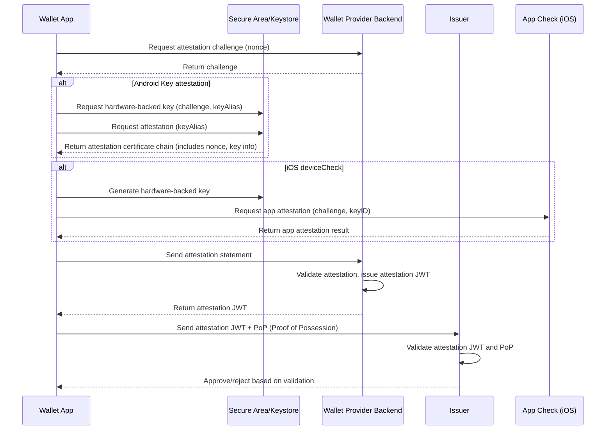

## Wallet Attestation - Implementation Considerations
(This is a work in progress and may include errors)

### Standards Alignment

The Bifold implementation aligns with the following standards:

   - OIDF OpenID4VCI 1.0 - Opinionated implementation in support of OpenID4VCI issuance: https://openid.net/specs/openid-4-verifiable-credential-issuance-1_0.html#name-wallet-attestations-in-jwt-

   - IETF OAuth 2.0 Attestation-Based Client Authentication. Defines the mechanics of the attestation as an authentication mechanism: https://datatracker.ietf.org/doc/html/draft-ietf-oauth-attestation-based-client-auth-08

### Initialization

The IETF specification is agnostic to the mechanism used to create the client attestation as long as it is cryptographically backed. For Bifold, native IOS and Android mechanisms are used.

The two vendors take different approaches based on their unique ecosystems but essentially achieve the same outcome:

   - The public key provided is backed by a secure area (SE, TEE, Strongbox etc). This key can then be used in subsequent challenges by to prove control of the private key.
   - The app has not been tampered with and is the same app that was signed by the developer.
   - Assurances to some level on the integrity of the device. There is some variability here.

**IOS**

Apple's DeviceCheck framework (including App Attest and key attestation) is a key attestation mechanism with support for a block list that can reject compromised devices (proprietary signals). Documentation is here: https://developer.apple.com/documentation/devicecheck/establishing-your-app-s-integrity.

Implementing the IOS device check requires a call to Apple servers (App Attest) from the mobile device which achieves the following:
   - Ensures the app is legitimate by matching App store records (Bundle ID)
   - Checks a block list created via signals that Apple has access to. The most obvious being a phone reported stolen, but others exist including possibly some related to inferring that a phone is Jailbroken. The signals do not appear to be formally documented.

The call to Apple Device Check is only required once. The result lives for the lifetime of the specific app version. Note that Apple may reject an attestation request if the Apple servers are too busy. The specifics on how the throttling is handled by Apple are not documented. The recommendation is to try again with an incremental back-out period.

**Android**

Android is a little more complex as there are two services that provide support for app integrity and an ecosystem of devices outside of the specific control of Google:

   - Google Play Integrity, which uses a signal based approach to provides verdicts on the app integrity. The approach does not cryptographically validate a secure area (TEE, Strongbox etc..) backed key. Play Integrity is meant for point in time short lived validations only and is expected to be run every time a high value backend API is called: https://developer.android.com/google/play/integrity/overview

   - Android Key Attestation, which provides much the same functionality as IOS device check. It only lacks the block list which overlaps with Play Integrity functions. Android Key Attestations are long lived - for the life of the specific app version: https://developer.android.com/privacy-and-security/security-key-attestation

Note: Google Play Integrity is specific to the Google ecosystem and will not work with Android devices outside of that ecosystem. It requires a Google account signed into the device and in some ways competes against proprietary RASP software. There is no specific equivalent on IOS except for some crossover with the device check block list and the fact that the IOS ecosystem is closed (e.g. no alternate app stores, yet...)

In the context of wallet attestation, Android key attestation is the appropriate tool for long lived wallet attestations. The EUDI ARF does include requirements for short lived device attestations where Google Play integrity or a third party RASP tool could be appropriate. These are not implemented in Bifold and it is not clear how they could be implemented without third party proprietary tooling - either on IOS or Android.

Android Key attestation does not require an API call to Google servers. The process to generate the attestation (certificate chain) is internal to the device. The attestation is used to validate the following:
   - The signing key of the app matches the expected signing key. This validates that app has not been tampered with. Note that it does not explicitly check that the App came from the Google Play store.
   - That the key pair was generated in the secure area
   - That the device is not rooted via a boot state claim check. This requires that any device with an unlocked boot loader must be rejected.
   - The Device is a Genuine OEM. It is up to the wallet provider to decide what root certificates they accept.

**React-Native Support**

The following Expo library is used to implement the IOS and Android OS level APIs: https://docs.expo.dev/versions/latest/sdk/app-integrity/ (in Alpha release). As per the OS requirements, a nonce is required from the backend server to generate the attested keys. The nonce is used to protect against replay attacks and is embedded in the attestation object. Unfortunately because of this nonce requirement the expo app integrity library is likely not suitable to generate hardware backed keys for other use cases - dPOP and hardware backed cryptographic holder binding. 

**Bifold**

The Bifold attestation logic is initiated during app initialization as part of the initial wallet setup. The setup will not complete if the attestation is not successful either due to the wallet provider backend not being responsive or Apple servers not being responsive. Once the wallet has exhausted retries an error message will be displayed to the user to try again later.

The approach is designed to fail early and with a clear error state. If the process was backgrounded the user might have the impression of a working wallet but could then experience a failure when trying to retrieve a credential. A failure at issuance is harder to diagnose and the user has likely invested time to proof themselves as part of the issuance process leading to increased frustration with the wallet. 

### Using the attestation JWT

The latest version of Credo-ts (0.6) supports presenting an attestation JWT and Proof of Possession JWT as an authentication mechanism during credential issuance using the OpenID4VCI protocol.

### Wallet provider server side validation of attestation objects

How an attestation object is validated is out of scope from a standards specification perspective. Each wallet provider is free to implement the validation to their own requirements. The wallet supports hooks for two API calls that must be injected:

   - Retrieve a nonce from the backend
   - Send the attestation object to the backend and return a signed client attestation JWT as per the IETF specification

For IOS, the backend server should follow the validation steps precisely as documented to validate the legitimacy of the certificate chain and embedded checks - https://developer.apple.com/documentation/devicecheck/attestation-object-validation-guide

For Android, there are some validation steps for the extended data in the certificate that must be followed in addition to the basic validate of the certificate chain - https://developer.android.com/privacy-and-security/security-key-attestation:

   **KeyDescription in Key Attestation extension of the certificate**
   - packageInfos lists the package names which must match your package name(s)
   - signatureCertificateDigests includes a SHA-256 hash of the each signing certificate. Make sure the hashes match the hashes of your app packages signing certificate(s)
   - keyStoreSecurityLevel (enum). It should be either 1 for TEE or 2 for Strongbox
   - deviceLocked should be True to block rooted devices

There are other data elements in the keyDescription that may be useful such as keymasterSecurityLevel, verifiedBootHash and version.

### Why this works for long lived wallet attestations

The initial process of creating an attested key creates a hardware bound key pair that cannot be exported from the device. At its core, the process of creating the attestation JWT proves that the wallet that created the key pair is the same app that was signed by the wallet developer. When requesting a credential at a later time the wallet must prove that the holder is still in control of the private key that was initially attested. The public key from this key pair is embedded in the signed attestation JWT.

This proof of possession will fail if the wallet is modified, as the code would need to be re-signed by the attacker to install on the device. The newly signed app would not have access to the key pair that was attested to and bound to the attestation JWT. 

As the secure area is isolated from the OS, even rooted or jailbroken devices would provide some protection - i.e. keys could still not be exported from the secure area but a modified app could perhaps run in the same app context and use the keys. More research is required on this point to confirm how and when key pairs in the secure area are "invalidated". Considerations:

   - On Android, a factory reset is required to unlock the boot loader which will also invalidate the secure area keys.
   - There ways to root some older Android device without unlocking the boot loader.
   - What about key invalidation for jailbreaking on IOS? This does not appear to be a built in function.
   - There are no modern Apple phones that can be jailbroken as of this writing.
   - It is hard to test various scenarios as modern devices cannot be rooted (without changing the bootloader) or jailbroken.
   - Where do RASP tools (including Play Integrity) fit in?

If the wallet is upgraded by the developer then the key pair could still be accessible. How to handle application updates is a TBD and may fall into the RASP category. On Android, the certificate extended data includes an app version. Unfortunately, IOS does not have any equivalent function that is cryptographically verifiable. Also, the openid4vci documented attestation JWT format does include a version of the wallet in its schema. The current assumption is that key pair should be invalidated on upgrade and refreshed. This needs more thought and testing.

**Important** This only works if the issuer trusts the wallet provider and has effectively audited or otherwise certified the wallet function.

### Capacity of the secure area - IOS and Android

Concerns around the capacity of the secure area to store key pairs have been raised in various forums. IOS and Android both support the HSM concept of key wrapping. With key wrapping, the key pair is encrypted via a key stored in the secure area and then stored outside the secure area in the keychain. All cryptographic operations happen in the secure area by moving the encrypted key pair in and out of the secure area. This effectively means unlimited key pair capacity (up-to available device storage capacity)

More research is needed to clarify OS versions that support this approach any other hidden limitations.

### OpenID4VCI Attestation Flow

