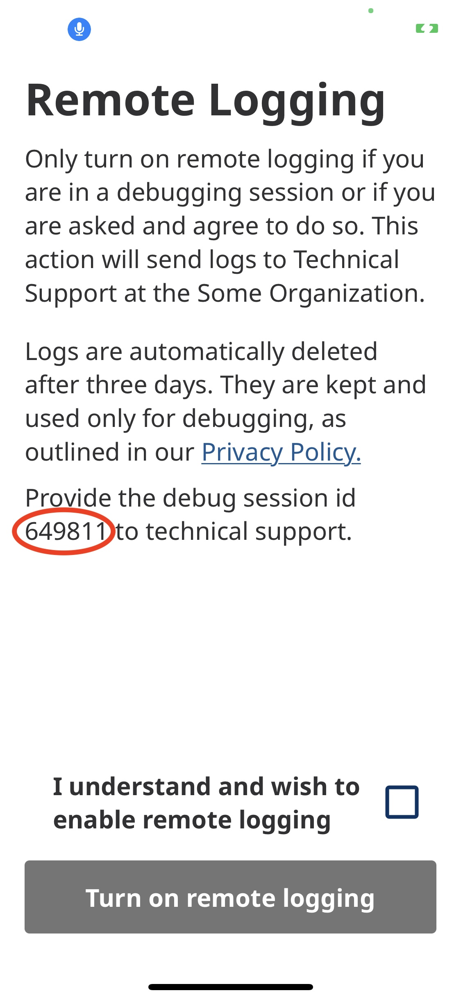
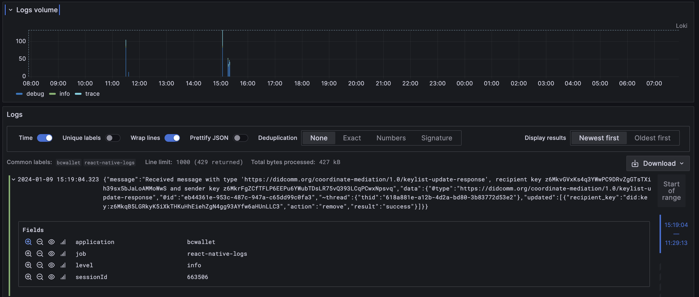

# TL;DR

The `@hyperledger/aries-remote-logs` package provides a simple way to send [Aries Framework Javascript](https://github.com/openwallet-foundation/agent-framework-javascript) (AFJ) logs to a remote [Loki](https://grafana.com/docs/loki/latest/) server.

## Usage

This package allows a copy of the AFJ logs to be sent to a remote Loki server. This is useful for debugging issues in environments where the logs are not easily accessible, yet the logs are needed to provide [Tier 3](https://en.wikipedia.org/wiki/Technical_support) support.

Due to the sensitive nature of Verifiable Credentials and Digital Identity in general, the logs are not sent automatically. Instead, this feature must be enabled. It is **highly recommended** that this feature be disabled by default in production environments and only enabled, by the end user, when needed, and even then automatically disabled after a short period of time.

## Considerations

When remote logging is enabled the `RemoteLogger` will generate a session ID automatically. This ID is then set as a label on all logs sent to the remote server. This allows the logs to be filtered by session ID. This is useful when debugging issues that are specific to a single user.

When the end user enables remote logging present them with the a session ID. This ID should be recorded and provided to the support team. The support team can then use this ID to identify the correct logs. This session ID is also helpful to minimize corelation of the logs with the end user.



Fetch the session ID with the following code:

```typescript
// ...
const { agent } = useAgent()
const logger = agent?.config.logger as RemoteLogger

console.log(`Session ID: ${logger.sessionId}`)
```

## Configuration

The `RemoteLogger` is configured with a set of options. These options are passed to the constructor of the `RemoteLogger` class. The options are as follows:

| Option                                      | Type                     | Description                                                                  |
| ------------------------------------------- | ------------------------ | ---------------------------------------------------------------------------- |
| `lokiUrl`                                   | `string`                 | The full URL of the Loki server.                                             |
| `lokiLabels`                                | `Record<string, string>` | A set of labels to be applied to all logs sent to the Loki server.           |
| `autoDisableRemoteLoggingIntervalInMinutes` | `number`                 | The number of minutes to wait before automatically disabling remote logging. |

The image below shows what a typical Grafana log query looks like. The query is filtered by the `application` and `job` labels. The `sessionId` label is used to filter the logs for a specific debug session.



### Example Usage

Setup the `RemoteLogger` and pass it to the AFJ `Agent` as shown below:

```typescript
import { RemoteLogger, RemoteLoggerOptions } from '@hyperledger/aries-remote-logs'

// ...

const autoDisableRemoteLoggingIntervalInMinutes = 90 // important
const lokiUrl = 'https://logs.example.com:3100/loki/api/v1/push'
const logOptions: RemoteLoggerOptions = {
  lokiUrl,
  lokiLabels: {
    application: 'bifold-wallet',
    job: 'react-native-logs',
  },
  autoDisableRemoteLoggingIntervalInMinutes,
}

const logger = new RemoteLogger(logOptions)
logger.startEventListeners()

const afjConfigOpts = {
  config: {
    label: 'Bifold Wallet',
    walletConfig: {
      id: 'some-wallet-id',
      key: 'some-secret-key',
    },
    logger,
    mediatorPickupStrategy: MediatorPickupStrategy.Implicit,
    autoUpdateStorageOnStartup: true,
    autoAcceptConnections: true,
  },
  dependencies: agentDependencies,
  modules: getAgentModules({
    indyNetworks: ledgers,
    mediatorInvitationUrl: Config.MEDIATOR_URL,
  }),
}

const agent = new Agent(options)

// ...
```

Enable and disable remote logging by sending events as shown below:

```typescript
import { DeviceEventEmitter } from 'react-native'
import { RemoteLoggerEventTypes } from '@hyperledger/aries-remote-logs'

// ...

// enable remote logging, this will send the logs to the remote server
// and will automatically disable remote logging after the specified
// interval.
DeviceEventEmitter.emit(RemoteLoggerEventTypes.ENABLE_REMOTE_LOGGING, true)

// ...
```
